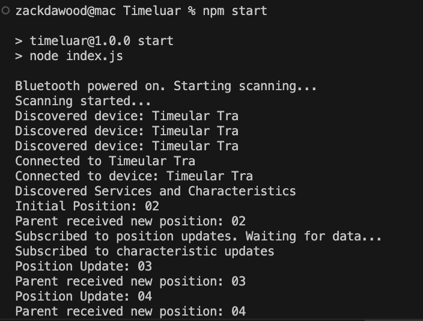

# Timeular Node.js Electron App

Timeular Tracker is a device that helps you track your time and activities.
Track time by flipping a time tracking cube
Track 1000 different activities by simply flipping the 8-sided, physical time tracking device.
This utility is designed to interface with Timeular Tracker devices via Bluetooth.
It provides a simple API to connect to a Timeular device and receive position updates in real-time.

### Timeular Resources
Timeular [https://timeular.com/](https://timeular.com/)
Timeular API [https://developers.timeular.com/](https://developers.timeular.com/)

### The timeularapi repository is designed to interface with Timeular devices using the following technologies:
- Node.js: The primary runtime environment for executing JavaScript code server-side.
- `@abandonware/noble`: A Node.js library that enables communication with Bluetooth Low Energy (BLE) devices.
- Electron: Utilized for building cross-platform desktop applications with web technologies.

### Getting Started

- Step 1: Checkout the code
- Step 2: Install Node.js
- Step 3: npm install
- Step 4: Run the app

### Runnning the app

`node index.js`

### Runnning the via npm

`node start`




### API Documentation
[timeularapi.md](./timeularapi.md)

### Sample client code documentation
[index.md](./index.md)

### Library used
[https://www.npmjs.com/package/@abandonware/noble](https://www.npmjs.com/package/@abandonware/noble)

#### Initial Setup if you are building ground up

`npm init`

`npm install @abandonware/noble`


#### If you still face issues, ensure you have the necessary tools to compile native bindings:

- On macOS:

```bash
xcode-select --install
```

- On Linux:

```bash
sudo apt-get install build-essential
```

- On Windows: Install Windows Build Tools:
```shell
npm install --global windows-build-tools
```

#### Rebuild Native Modules

```bash
npm rebuild
```

#### Check Dependencies and Update
```bash
rm -rf node_modules package-lock.json
npm install
```

### Upcoming Integration Releases
1. Hackaru [https://github.com/hackaru-app](https://github.com/hackaru-app)
2. Clockify [https://app.clockify.me/tracker](https://app.clockify.me/tracker)
3. Traggo [https://github.com/traggo/](https://github.com/traggo/)
4. toggl [https://toggl.com/](https://toggl.com/)
